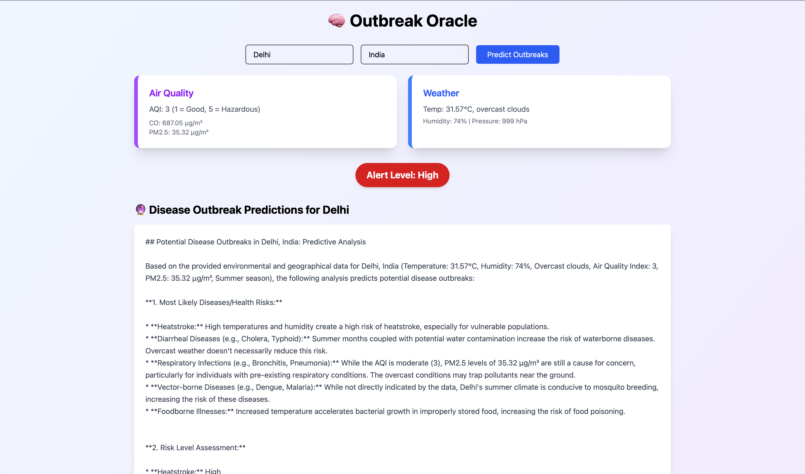

# 🧠 Outbreak Oracle

A React-based disease outbreak prediction system that uses environmental data, weather conditions, and AI analysis to predict potential health risks in any city.



## ✨ Features

### 🌍 Environmental Monitoring
- **Real-time Weather Data**: Fetches current temperature, humidity, pressure, and weather conditions
- **Air Quality Analysis**: Monitors Air Quality Index (AQI), PM2.5, and CO levels
- **Location-based Search**: Enter any city and region for customized predictions

### 🤖 AI-Powered Disease Prediction
- **Gemini AI Integration**: Uses Google's Gemini AI to analyze environmental factors
- **Seasonal Analysis**: Considers current season for more accurate predictions
- **Risk Assessment**: Provides High, Moderate, or Low risk levels
- **Comprehensive Health Reports**: Detailed analysis including:
  - Most likely diseases for the location and season
  - Environmental risk factors
  - Preventive measures and recommendations
  - Vulnerable population identification

### 📊 Data Visualization
- **Interactive Cards**: Beautiful cards displaying weather and air quality data
- **Alert System**: Color-coded alert levels (Red for High, Yellow for Moderate, Green for Low)
- **Responsive Design**: Works seamlessly on desktop and mobile devices
- **Smooth Animations**: Framer Motion animations for better user experience

### 🎨 Modern UI/UX
- **Tailwind CSS Styling**: Clean, modern design with gradient backgrounds
- **Loading States**: Elegant loading animations during data fetching
- **Real-time Updates**: Instant data refresh with the click of a button
- **Accessibility**: User-friendly interface with proper focus states

## 🛠️ Technologies Used

- **Frontend**: React 19.1.0
- **Styling**: Tailwind CSS 4.1.11
- **Animations**: Framer Motion 12.23.0
- **HTTP Client**: Axios 1.10.0
- **Build Tool**: Vite 7.0.0
- **AI Integration**: Google Gemini API
- **Weather API**: OpenWeatherMap API

## 🚀 Getting Started

### Prerequisites
- Node.js (v18 or higher)
- npm or yarn

### Installation

1. Clone the repository:
```bash
git clone <repository-url>
cd hackthon
```

2. Install dependencies:
```bash
npm install
```

3. Start the development server:
```bash
npm run dev
```

4. Open your browser and navigate to `http://localhost:5173`

### Build for Production

```bash
npm run build
```

## 🌐 API Integration

The application integrates with multiple APIs:

- **OpenWeatherMap API**: For weather and air quality data
- **Google Gemini API**: For AI-powered disease prediction analysis

## 📱 Usage

1. **Enter Location**: Input your desired city and region
2. **Fetch Data**: Click "Predict Outbreaks" to gather environmental data
3. **View Analysis**: Review the AI-generated health risk assessment
4. **Check Alert Level**: Monitor the color-coded risk level indicator
5. **Read Recommendations**: Follow the preventive measures and health advice

## 🔧 Available Scripts

- `npm run dev` - Start development server
- `npm run build` - Build for production
- `npm run lint` - Run ESLint
- `npm run preview` - Preview production build

## 📂 Project Structure

```
src/
├── components/
│   ├── GemeniAnalyser.jsx    # Main outbreak prediction component
│   └── OutBreak.jsx          # Alternative component with news integration
├── assets/
│   └── react.svg
├── App.jsx                   # Main app component
├── main.jsx                  # Entry point
├── App.css                   # App styles
└── index.css                 # Global styles with Tailwind
```

## 🤝 Contributing

1. Fork the repository
2. Create a feature branch (`git checkout -b feature/new-feature`)
3. Commit your changes (`git commit -am 'Add new feature'`)
4. Push to the branch (`git push origin feature/new-feature`)
5. Create a Pull Request

## 📄 License

This project is open source and available under the [MIT License](LICENSE).

## 🙏 Acknowledgments

- OpenWeatherMap for weather and air quality data
- Google Gemini for AI-powered analysis
- React and Vite communities for excellent tooling
- Tailwind CSS for beautiful styling utilities

